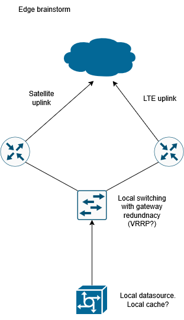
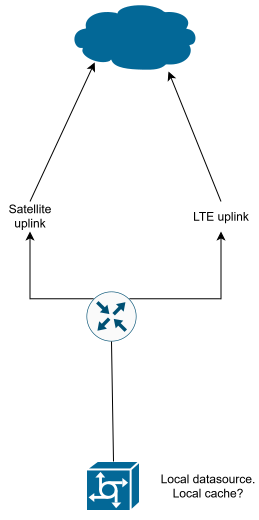

# HighAvailable-Mesh-Design
Design Exercise. Mobile platform leveraging mesh topology. 

# What is this? 
## problem statement
A mobile platform needs higly available redundant connectivity to both publically accessible and private (on-prem) resources. 
edge connectivity options should be of different modes (ex: LTE and satellite)
assume very challenging environment.  

Traffic must be encrypted, is overhead an issue? what are options for a "skinny" tunnel encryption stack?

## tunnel/vpn options
wireguard seems to be a popular choice
overhead 60 bytes for ipv4, 80 for ipv6
mtu 1420 or lower
no keepalives

SoftEther might be worth looking into?

https://www.paloaltonetworks.com/cyberpedia/types-of-vpn-protocols#wireguard

## Routing:
Babel? is this a true mesh?

## Mobile Edge:
First thought, redundant "router" with a dedicated edge mediums (LTE, satellite, whatever)

Second thought, If space and weight are a concern, some redundancy could be traded off for a single "router", with multiple edge mediums types

What are we meshing with? additional mobile nodes? multiple stationary edge points?
